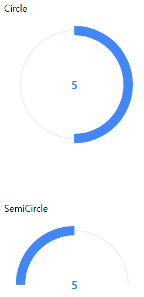

# BasicProgressBar

> 공통함수화로 코드의 재사용을 최소화.



## 파일
> ProgressBar.js는 최신버전 사용을 권장, 내장된 ProgressBar.js를 기반으로 만든 BasicProgressBar파일임.

1. ProgressBar.js 관련 js파일
2. BasicProgressBar 파일
3. 예제 HTML파일

## 구현기능
- 쉬운사용

## 사용 순서
0. `$.extend(true,<TARGET>,basicProgressBar);`으로 덮어씌워 사용
1. `CSS`에서 ProgressBar의 크기지정
2. `init`으로 ProgressBar가 보여질 태그ID지정, 속성정의, 프로그래스바`Type`설정
3. `getData`으로 `Ajax`(혹은 다른방법)데이터를 가져옴
4. `setCurrentValue`로 값(`MaxValue`(최대값), `CurrentValue`(현재값))설정후 `draw`으로 ProgressBar를 그림

## ProgressBar.js의 옵션들
> 공통 ProgressBar의 기본 옵션을 변경하려면 `ProgressBar.js`에서 기본 속성을 변경할 수 있음.

> 하나의 ProgressBar만 속성을 변경하려면 `init`에서 `customConfig`으로 해당 테이블만 속성을 변경할 수 있음.

🔍[ProgressBar.js Docs](https://progressbarjs.readthedocs.io/en/latest/)

📌[ProgressBar.js CircleExample](https://jsfiddle.net/kimmobrunfeldt/72tkyn40/)

📌[ProgressBar.js SemiCircleExample](https://jsfiddle.net/kimmobrunfeldt/sqwdkrg0/)

## 문제점
- `Circle`, `SemiCircle`만 사용가능
    - `basicProgressBar`를 조금 더 손보면 다른 형태도 가능함.

## 응용 및 용도
- 프로젝트의 특성에 맞게 `basicProgressBar`에 ProgressBar관련 공통함수 추가작성 가능
- 코드의 재사용성을 낮춰 코드를 간결화
- 대시보드 등 쉽게 적용가능
- 쉬운사용(?)

## getData -> ajax 사용법
```JavaScript
var testPG = {
    ...,
    getData: function(){
        $.ajax({
            url: 'url',
            method: 'get || post || ...',
            contentType:"application/json",
            ...
            success: function (data, status, xhr) {

                ... // (필요시)데이터 파싱작업.
                //반드시 최대값, 현재값이 필요함
                testPG.setCurrentValue(data.MaxValue, data.CurrentValue)
                testPG.draw();

            },
            error: function (data, status, err) {
                ...
            },
            complete: function () {
                ...
            }
        });
    }
}
```
## ProgressBar.js LICENSE
```
The MIT License (MIT)

Copyright (c) 2015 Kimmo Brunfeldt

Permission is hereby granted, free of charge, to any person obtaining a copy
of this software and associated documentation files (the "Software"), to deal
in the Software without restriction, including without limitation the rights
to use, copy, modify, merge, publish, distribute, sublicense, and/or sell
copies of the Software, and to permit persons to whom the Software is
furnished to do so, subject to the following conditions:

The above copyright notice and this permission notice shall be included in
all copies or substantial portions of the Software.

THE SOFTWARE IS PROVIDED "AS IS", WITHOUT WARRANTY OF ANY KIND, EXPRESS OR
IMPLIED, INCLUDING BUT NOT LIMITED TO THE WARRANTIES OF MERCHANTABILITY,
FITNESS FOR A PARTICULAR PURPOSE AND NONINFRINGEMENT. IN NO EVENT SHALL THE
AUTHORS OR COPYRIGHT HOLDERS BE LIABLE FOR ANY CLAIM, DAMAGES OR OTHER
LIABILITY, WHETHER IN AN ACTION OF CONTRACT, TORT OR OTHERWISE, ARISING FROM,
OUT OF OR IN CONNECTION WITH THE SOFTWARE OR THE USE OR OTHER DEALINGS IN
THE SOFTWARE.
```